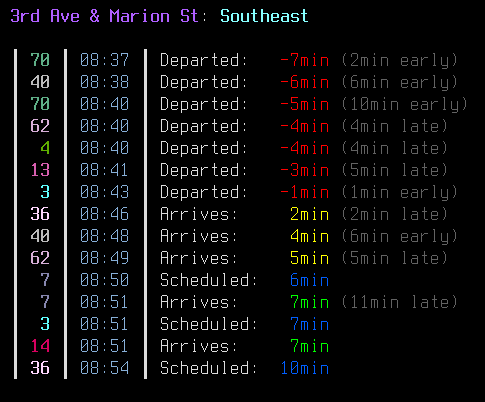

# onebusaway-cli
Linux CLI display of bus arrivals at a stop using the OneBusAway API

- Requires the blessings Python library
- See code comments and example config file for usage. Config file goes in ~/.config/onebuscli/config.ini
- Intended for 256+ color terminals, but will display without color on other terminals
- Warnings:
  - Only tested on the Puget Sound OneBusAway API
  - Code is quick and messy, with almost no error handling - sorry
